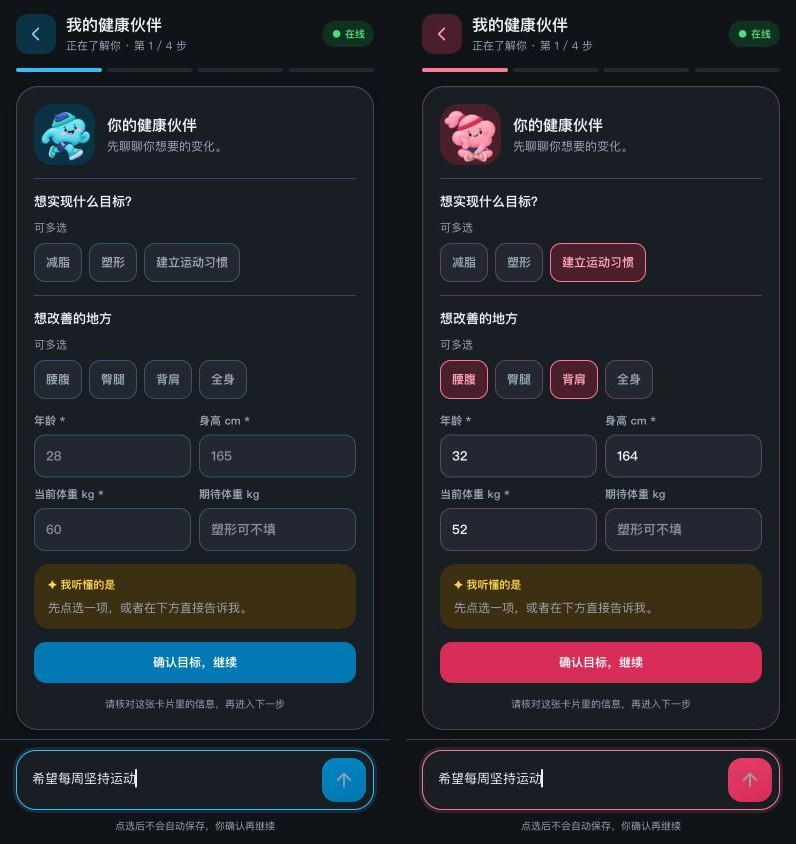

# 深色模式检查 · 2026-10-08

## 问题与修复

用户截图中系统栏已经为深色，但目标建档仍是浅色。原因是 `private-coach.css` 单独写死了白底和浅色文字，没有使用主界面的主题变量。相同样式还用于每周、每日及恢复码场景。

| 发现 | 范围 | 修复与证据 |
| --- | --- | --- |
| 目标建档的整屏浅色遗漏 | 四步建档、首周计划、理解卡、选项、输入、加载、失败 | 接入全局主题与双身份色；[修改前](before-goal.jpg)、[蓝色深色](goal-dark-blue.jpg)、[粉色深色](goal-dark-pink.jpg)、[身体](health-dark.jpg)、[安排](schedule-dark.jpg)、[计划](plan-dark.jpg) |
| 其他健康伙伴弹窗遗漏 | 每周确认、今日调整、恢复码输入/保存、退出确认、通知提示 | 统一背景、文字与状态色；[每周](weekly-dark.jpg)、[每日](daily-dark.jpg)、[找回](recover-dark.jpg)、[保存码](recovery-dark.jpg)、[退出](signout-dark.jpg)、[提示](notice-dark.jpg) |
| 主界面小卡片写死白底 | 伴侣趋势、系统通知 | 使用 `--surface / --muted / --shadow`；[记录](record-dark.jpg) |
| 发送字符箭头较粗且依赖字体 | 前三步底部输入区域 | Lucide SVG 22 px；44×44 px 触摸区、轻渐变、焦点轮廓；[发送中](send-busy.jpg)、[失败](send-error.jpg) |

主界面的今日、饮食、训练、记录、角色选择、家庭口令、旧版目标和饮食记录弹窗已有主题支持，逐项检查后未发现同类整屏白底遗漏。动作插画容器接入主题底色；GIF/PNG 自身包含的浅色画布保留。

| 已检查场景 | 截图 |
| --- | --- |
| 今日 / 饮食 / 训练 / 记录 | [今日](today-dark.jpg)、[饮食](diet-dark.jpg)、[训练](train-dark.jpg)、[记录](record-dark.jpg) |
| 角色 / 家庭口令 / 旧目标 / 饮食弹窗 | [角色](role-dark.jpg)、[家庭口令](family-dark.jpg)、[旧目标](legacy-goal-dark.jpg)、[饮食](food-dark.jpg) |
| 训练执行 / 浅色回归 / 窄屏 | [训练执行](workout-dark.jpg)、[浅色蓝](goal-light-blue.jpg)、[浅色粉](goal-light-pink.jpg)、[320 px](goal-320.jpg) |

## 验证方法与结果

- 本机浏览器调用真实 `index.html` 样式与渲染代码、真实 `DuoCoach`；使用合成档案，不加载 `config.js`，AI 响应为本地模拟。复现：启动仓库 HTTP 服务，打开 `/tests/theme-preview.html?theme=dark&person=hus&view=onboard&step=0`。
- 浅色/深色 × 蓝色/粉色，在 320、375、390、430 px 宽度下检查目标页：无横向溢出，发送区域保持可见，按钮始终 44×44 px；原生控件的 `color-scheme` 与主题一致。
- 实际输入与点击验证：空输入禁用；有文字启用；分析时禁用并显示 spinner；成功后恢复编辑；失败后原文保留、spinner 清除、可重试。未重新调用线上 AI 或修改真实健康数据。
- `node tests/scenarios.js`、`node tests/sw-cache.js` 通过；内联脚本、主题场景脚本、`private-coach.js`、`sw.js` 语法检查通过。
- 检查为桌面浏览器手机视口预览，未覆盖实体 iPhone 键盘与系统安全区的全部行为，不代表完整的无障碍认证。

缓存为 `duofit-v19`，健康伙伴 CSS/JS 地址同步使用 `?v=19`。在线页面优先读取新版，离线时回退已保存内容。

