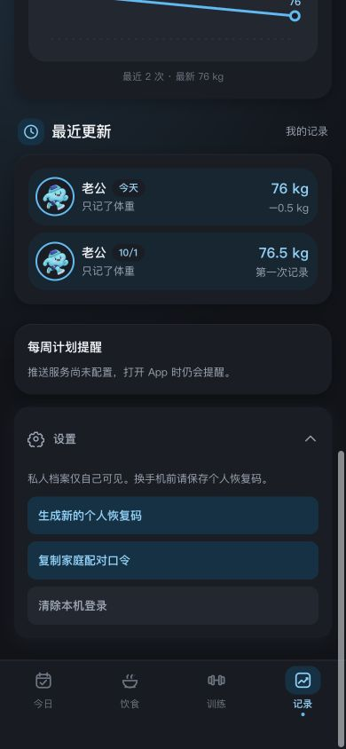
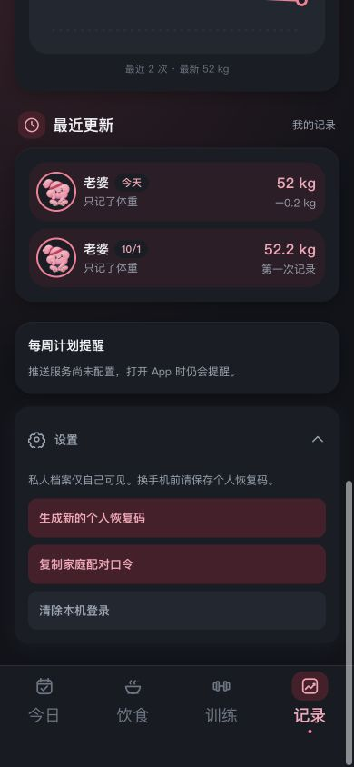

# 记录页设置按钮与安全区 · 2026-10-08

## 问题

主内容 `.wrap` 固定预留 104 px，底部固定导航的高度却包含 `safe-area-inset-bottom`。在 390×844、模拟 34 px 底部安全区时，导航实测高 100.59 px，页面滚动到底后设置卡片与导航仅相隔 3.59 px，卡片阴影紧贴导航。导航文字放大后预留空间不足会进一步加重遮挡。

## 修复

1. 导航和 CSS 备用留白共用安全区变量。
2. `initTabBarSpace` 测量导航完整高度并使用 `ResizeObserver` 跟踪尺寸变化；`.wrap` 保留至少“实际导航高度 + 24 px”，并设置对应的滚动聚焦留白。
3. 设置仍保留三个原有操作；320 px 下身体记录网格和数字输入允许收缩，修复保存按钮横向撑出卡片。

## 验证

通过本机 `tests/theme-preview.html` 加载真实 App 样式、渲染与布局初始化代码，使用合成档案与安全区。点击展开设置，滚动到页面末尾，测量卡片/按钮相对导航的位置。

| 尺寸 | 主题 | 安全区 | 结果 |
| --- | --- | --- | --- |
| 320×667 | 深色蓝 | 34 px | 设置按钮均露出；间距 24.65 px，无横向溢出 |
| 375×667 | 浅色粉 | 0 px | 设置按钮均露出；间距 37.23 px，无横向溢出 |
| 390×844 | 深色蓝 | 34 px | 设置按钮均露出；间距 24.59 px，无横向溢出 |
| 430×932 | 浅色粉 | 34 px | 设置按钮均露出；间距 24.59 px，无横向溢出 |
| 390×844 | 深色粉、18 px 导航文字 | 34 px | 导航增高后留白升至 136 px；间距 24.10 px，无横向溢出 |
| 844×390 | 深色蓝、横屏 | 21 px | 设置按钮均露出；间距 24.52 px，无横向溢出 |

详细测量保存在 [results.json](results.json)。`tests/scenarios.js`、`tests/sw-cache.js` 及页面/场景脚本语法检查通过。验证使用浏览器手机视口和模拟安全区，仍需用户在真实 iPhone 上确认系统缩放与滚动表现。

## 后续纠正

用户指出的原始截断还包含“设置”左侧齿轮图标。v20 仅修复了底部留白，没有修到旧齿轮超出 SVG 画板的路径；齿轮本身在 v21 中修复，见 [设置图标对照](../settings-icon/README.md)。
